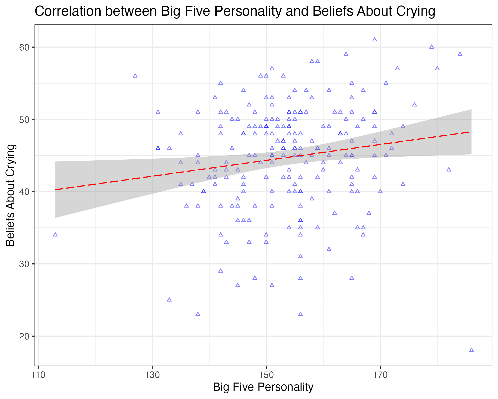

```{r setup, include=FALSE}
knitr::opts_chunk$set(echo = TRUE)
# printing decimals up to two places
knitr::knit_hooks$set(inline = function(x) {
  if (x == 0) {
    x <- "0"
  } else {
    x <- sprintf("%1.2f", x)
    paste(x, collapse = ", ")
  }
})
```

# Reproducibility 

## Tip 1: Set things up at the beginning

It's a good practice to load all libraries and import data that will be used at the top of the document. 

```{r message=FALSE, warning=FALSE}
# load library
library(tidyverse)
# import data (beliefs about crying scale)
bacs <- read.csv("https://osf.io/6gsy8/download")
```

## Tip 2: Create a new data frame after making changes

I highly recommend saving the wrangled data frame into a new object and keep a copy of the original data frame. In any case the new data frame is messed up, we can always start again from the original data frame. 

```{r}
# good practice
bacs_sub <- bacs %>%
  select(Gender, Age)
names(bacs_sub)
# oh I forgot to include Ethnic
# let's start again from bacs which contains all variables
bacs_sub <- bacs %>%
  select(Gender, Age, Ethnic)
names(bacs_sub)
```

```{r eval=FALSE}
# bad practice
bacs <- bacs %>%
  select(Gender, Age)
# now if we need Ethnic, all variables except Gender and Age are gone...
names(bacs)
# we need to reload the data to restore all variables
bacs <- read.csv("https://osf.io/6gsy8/download")
```

## Tip 3: Avoid hard coding

Let's say we would like to report the mean of the sum scores of belief about crying. 

```{r}
bacs_sum <- bacs %>%
  # calculate the sum score per individual
  mutate(big5_sum = rowSums(across(contains("BigV"))), 
         bacs_sum = rowSums(across(contains("BACS"))), 
         gender = recode(Gender, `1` = "Male", `2` = "Feamle"), 
         age_bin = ifelse(Age >= 19, "Older than or at age 19", 
                          "Younger than age 19"))
```

```{r}
(bacs_mean <- mean(bacs_sum$bacs_sum))
```

We should avoid hard coding by typing the number 44.72, but instead use "`r bacs_mean`" to print the result, mean of BACS = `r bacs_mean`. 

\newpage

# Document format

## Tip 1: Set chunk options

To hide outputs, such as a long data frame, use the chunk option `results='hide'`. 

```{r results='hide'}
bacs
```

To hide codes, use the chunk option `echo=FALSE`. 

```{r echo=FALSE}
bacs_sum %>%
  ggplot(aes(x = big5_sum, y = bacs_sum)) + 
  geom_point(size = 1, alpha = .5, col = "blue", shape = 2) +
  geom_smooth(method = "lm", size = .5, alpha = .4, 
              col = "red", linetype = "longdash") +
  facet_grid(gender ~ age_bin) + 
  labs(x = "Big Five Personality", y = "Beliefs About Crying", 
       title = "Correlation between Big Five Personality and Beliefs About Crying") + 
  theme_bw()
```

To suppress warnings and messages, use the chunk option `warnings=FALSE` and `message=FALSE`. 

```{r echo=FALSE, warning=FALSE, message=FALSE}
bacs_sum %>%
  ggplot(aes(x = big5_sum, y = bacs_sum)) + 
  geom_point(size = 1, alpha = .5, col = "blue", shape = 2) +
  geom_smooth(method = "lm", size = .5, alpha = .4, 
              col = "red", linetype = "longdash") +
  facet_grid(gender ~ age_bin) + 
  labs(x = "Big Five Personality", y = "Beliefs About Crying", 
       title = "Correlation between Big Five Personality and Beliefs About Crying") + 
  theme_bw()
```

To show but not evaluate a code chunk, use the chunk option `eval=FALSE`. 

```{r eval=FALSE}
# will not be evaluated
bacs_test <- bacs
```

If a code chunk produces an error, R will stop knitting the entire document. It's best to fix the bugs and resolve the errors. But sometimes if we want to force R to knit a document even if there an error, use the chunk option `error=TRUE`

```{r error=TRUE}
# as the above chunk wasn't evaluated, 
# bacs_test does not exist
bacs_test
```

## Tip 2: Table of content

The very top of the document contains the YAML metadata which determines the output format of the document.

```{r eval=FALSE}
---
title: 'GC3 Workshop: Making a Reproducible Report'
author: "Winnie Wing-Yee Tse"
date: "`r Sys.Date()`"
output:
  html_document:
    toc: yes
    toc_depth: '2'
    df_print: paged
  pdf_document:
    toc: yes
    toc_depth: 2
---
```

`toc: TRUE` indicates that we want to include a table of content, and `toc_depth: 2` denotes that the level-1 and level-2 headers will be shown in the content page. 


## Tip 3: Cheatsheet & Miscellaneous 

Here is a [Rmarkdown cheatsheet](https://www.rstudio.com/wp-content/uploads/2015/02/rmarkdown-cheatsheet.pdf), which includes details about section headers, lists, etc.

Remember that one of my favorite functions is `ggsave()`? We can attach a previously exported image to a document, which sometimes saves us time from knitting the document when the running the analysis and making a plot are complex and computational intensive. 

```{r}

```

